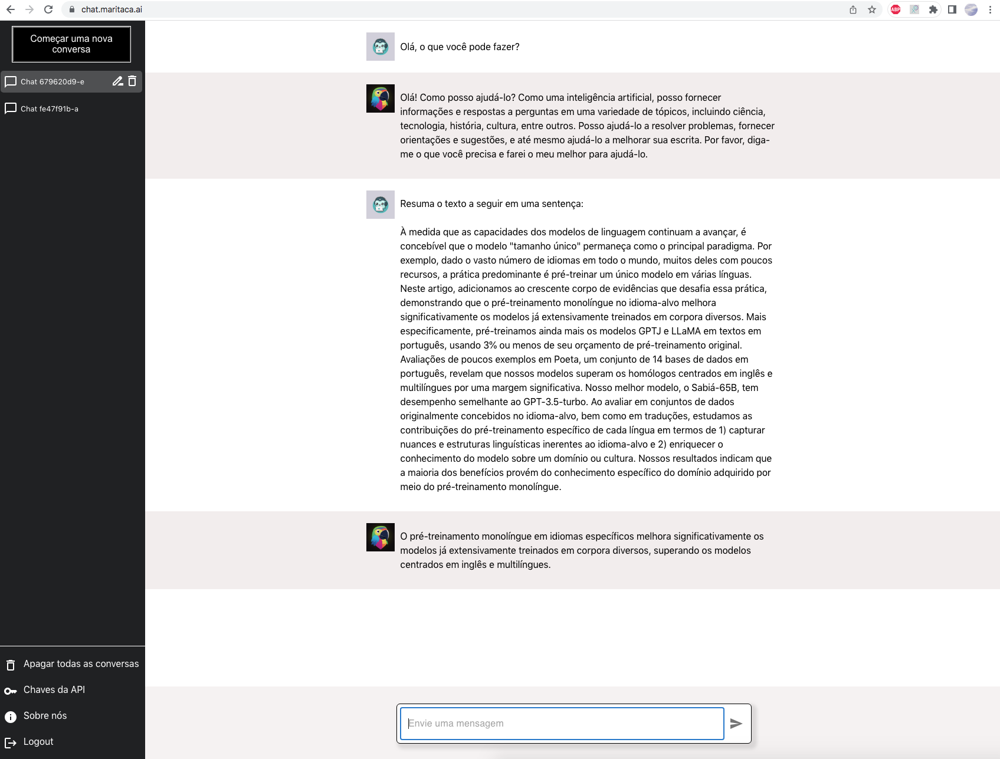

# Introdução
Este repositório contém o código e a documentação explicando como usar a API da MariTalk e a versão local para deploy on-premises.
A MariTalk é uma assistente baseada em um modelo de linguagem que foi especialmente treinado para entender bem o português.
Ela é capaz de seguir instruções de maneira zero-shot, assim como o ChatGPT.

# Instalação

Instale a biblioteca da MariTalk usando pip:
```bash
pip install maritalk
```

# Exemplo de Uso

Mostramos abaixo um exemplo simples de uso em Python.

Primeiramente, você precisa de uma chave da API, que pode ser obtida em chat.maritaca.ai -> "Chaves da API" -> "Crie uma chave".

```python
import maritalk

model = maritalk.MariTalk(key="insira sua chave aqui. Ex: '100088...'")

answer = model.generate("Quanto é 25 + 27?")

print(f"Resposta: {answer}")   # Deve imprimir algo como "25 + 27 é igual a 52."
```

## Modo chat

Você pode definir uma conversa especificando uma lista de dicionários, sendo que cada dicionário precisar ter duas chaves: `content` e `role`.

Atualmente, a API da MariTalk suporta dois valores para `role`: "user" para mensagens do usuário, e "assistant" para mensagens do assistente.

Mostramos um exemplo de conversa abaixo:
```bash
messages = [
    {"role": "user", "content": "sugira três nomes para a minha cachorra"},
    {"role": "assistant", "content": "nina, bela e luna."},
    {"role": "user", "content": "e para o meu peixe?"},
]

answer = model.generate(
    messages,
    do_sample=True,
    max_tokens=200,
    temperature=0.7,
    top_p=0.95)

print(f"Resposta: {answer}")   # Deve imprimir algo como "nemo, dory e neptuno."
```

## Exemplos few-shot

Embora a MariTalk seja capaz de responder a instruções sem nenhum exemplo de demonstração, fornecer alguns exemplos da tarefa pode melhorar significativamente a qualidade de suas respostas.

Abaixo mostramos como isso é feito para uma tarefa simples de análise de sentimento, i.e., classificar se uma resenha de filme é positiva ou negativa.
Neste caso, passaremos dois exemplos few-shot, um positivo e outro negativo, e um terceiro exemplo, para o qual a MariTalk efetivamente fará a predição.

```python
prompt = """Classifique a resenha de filme como "positiva" ou "negativa".

Resenha: Gostei muito do filme, é o melhor do ano!
Classe: positiva

Resenha: O filme deixa muito a desejar.
Classe: negativa

Resenha: Apesar de longo, valeu o ingresso..
Classe:"""

answer = model.generate(
    prompt,
    chat_mode=False,
    do_sample=False,
    max_tokens=20,
    stopping_tokens=["\n"]
)

print(f"Resposta: {answer.strip()}")  # Deve imprimir "positiva"
```

Note que usamos `chat_mode=False`, pois melhora a qualidade das respostas quando usando exemplos few-shot.

O argumento `stopping_tokens=["\n"]` é usado para interromper a geração quando o token "\n" é gerado. Isso é necessário porque, quando não estamos no modo chat, o modelo pode não saber quando interromper a geração.

Para tarefas com apenas uma resposta correta, como no exemplo acima, é recomendado usar `do_sample=False`. Isso garante que a mesma resposta seja gerada dado um prompt específico.

Para tarefas de geração de textos diversos ou longos, é recomendado usar `do_sample=True` e `temperature=0.7`. Quanto maior a temperatura, mais diversos serão os textos gerados, mas há maior chance de o modelo "alucinar" e gerar textos sem sentido. Quanto menor a temperatura, a resposta é mais conservadora, mas corre o risco de gerar textos repetidos.

## Usando a API via requisições HTTP

Este Google Colab contém outros exemplos de uso da API através de requisições HTTP:

[Exemplo no Google Colab](https://colab.research.google.com/drive/1DyaxA_rWfgvpY95Jqc3_OsBN9Y13PhdX?usp=sharing)

Você pode encontrar mais detalhes sobre os parâmetros mostrados acima (do_sample, max_tokens, etc) em https://chat.maritaca.ai/docs

## Modo local

Além da API hospedada pela Maritaca AI, também é possível executar uma versão local da MariTalk que pode ser obtida através [deste link](https://chat.maritaca.ai/checkout). A versão atual está em fase beta e possui capacidades limitadas (NPM de 45.4 no [Poeta benchmark](https://arxiv.org/abs/2304.07880)).

O executável pode ser executado em um Linux 64-bit com 1 ou mais GPUs Nvidia. A GPU precisam ter, no mínimo, 12GB de memória para rodar o menor modelo MariTalk. Atualmente, as GPUs testadas são da arquitetura Ampere (A100, A6000, A10).

[Aqui](./examples/local/) estão alguns exemplos de como utilizar a API local da MariTalk. Também disponibilizamos um [Google Colab](https://colab.research.google.com/drive/1Z-jtxISFTm9QOzErShck_eP_DcR8Jvct?usp=sharing) com os passos para executar a API em uma Nvidia A100 40GB (é necessário Colab Pro para executar o notebook).

#### Dependências

As principais dependências são as bibliotecas CUDA para comunicação com a GPU e de SSL. Para instalar as bibliotecas da Nvidia compatíveis com seu driver, é recomendado instalar o CUDA Toolkit na versão 11 ou 12. Exemplo: `apt install cuda-toolkit-12`. Atualmente suportamos as versões de CUDA 11 e 12 e Ubuntu versões 20 e 22.

Também é possível executar a MariTalk em um container Docker utilizando as imagens da Nvidia com as dependências necessárias já instaladas. Por exemplo, a imagem `nvidia/cuda:11.8.0-devel-ubuntu22.04` pode ser utilizada para executar o binário compatível com Ubuntu 22 e CUDA 11.

#### Execução

```
$ ./maritalk [OPTIONS] --license <LICENSE>
```

`--license <LICENSE>`: Sua chave de licença.

`-p, --port <PORT>`: Porta HTTP para escutar. [padrão: 9000]

`-h, --help`: Mostra uma mensagem de ajuda com a descrição dos argumentos disponíveis.

`-V, --version`: Mostra a versão do executável.

#### Modo interativo

Também é possível utilizar a MariTalk Local no próprio terminal sem precisar fazer requisções à API através do modo interativo:

```
$ ./maritalk [OPTIONS] --license <LICENSE> --interactive
(...)
>> olá
MariTalk: Olá! Como posso ajudar você hoje?
>> crie uma lista de compras para uma festa de aniversário
MariTalk: Aqui está uma lista de itens que você pode precisar para uma festa de aniversário:

1. Doces: cupcakes, brownies, bolos, etc
2. Bebidas: água, refrigerante, cerveja, suco, etc
3. Decorações: balões, confetes, fitas, etc
4. Lembrancinhas: chaveiros, sacolas, canetas, etc
5. Lanternas: para decorar o ambiente
6. Mesa: guardanapos, copos, talheres, pratos
7. Música: CD ou MP3 player com música, alto-falante
8. Tendas: para proteger da chuva ou do sol
9. Mesas e cadeiras: para os convidados se sentarem
10. Utensílios de cozinha: panelas, talheres, copos, pratos, etc
11. Acessórios: guarda-sol, guarda-chuva, toalhas, etc
12. Lanterna: para levar para caminhar

Lembre-se de sempre incluir produtos de qualidade e que sejam suficientes para atender a todos os convidados.
```

#### Integração com esta biblioteca

Também é possível fazer o download, inicializar e executar a MariTalk local utilizando a biblioteca em Python. Basta obter uma licença e chamar o método `start_server`. O retorno das chamadas contém o texto gerado e os tempos de espera, de execução do prompt e da geração do texto para fins de debug do usuário. Para comparação, o tempo esperado para gerar 512 tokens com um prompt de entrada de 512 tokens é de ~7s em uma Nvidia A100 80GB (aproximadamente 70 tokens/s).

```python
>>> import maritalk

>>> client = maritalk.MariTalkLocal()
>>> client.start_server(license='00000-00000-00000-00000')

>>> client.status()
{'status': 'idle'}

>>> client.generate("""Classifique a resenha de filme como "positiva" ou "negativa".

Resenha: Gostei muito do filme, é o melhor do ano!
Classe: positiva

Resenha: O filme deixa muito a desejar.
Classe: negativa

Resenha: Foi fantástico, valeu o ingresso..
Classe:""", max_tokens=2, do_sample=False)
{'output': 'positiva', 'queue_time': 0, 'prompt_time': 158, 'generation_time': 9}

>>> messages = [
    {"role": "user", "content": "sugira três nomes para a minha cachorra"},
    {"role": "assistant", "content": "nina, bela e luna."},
    {"role": "user", "content": "e para o meu peixe?"},
]
>>> client.generate_chat(messages)
{'output': 'nani, bento e leo.', 'queue_time': 0, 'prompt_time': 185, 'generation_time': 127}
```

# Aspectos Técnicos

### A API é gratuita?
A API está disponível gratuitamente para todos os usuários. Planejamos introduzir uma versão paga no futuro que oferecerá maior capacidade e confiabilidade.

### Limite de Taxa de Requisições
No momento, há um limite de uma solicitação a cada 5 segundos para garantir que todos tenham a oportunidade de testar o modelo. Será retornado um erro HTTP 429 caso a taxa de requisições ultrapasse esse limite.

### Comprimento máximo de sequência
Atualmente, suportamos um comprimento máximo de sequência de 8000 tokens, que é equivalente a aproximadamente 4000 palavras em português.

### Capacidade de Processamento
Leva cerca de 1 a 2 segundos para gerar o primeiro token, dado uma sequência de 1000 tokens como entrada.
Após isso, novos tokens são gerados a uma taxa de 10 a 15 tokens/seg.

# Interface Web
Experimente a interface Web em:
[chat.maritaca.ai](https://chat.maritaca.ai/)


